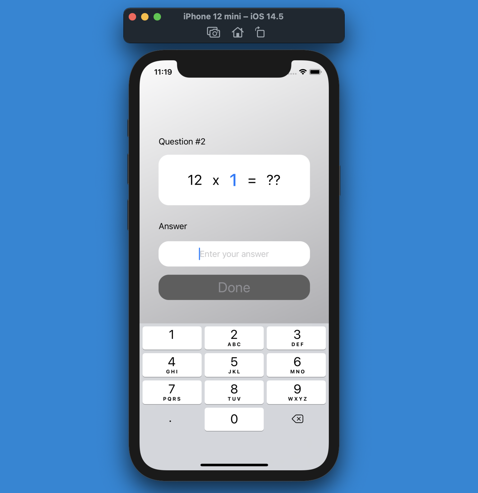

#  Math Multiply Game

This is the game for train your math multiply from table 1 to 12, Enjoy!

### You can set your game on setting page( table you wanna play, number of questions)
 

### Tim to play!
 

### Correct!
 

### Wrong!
 

### Your result, and you can play the next level, the same level again, or you can set a new game.
 

